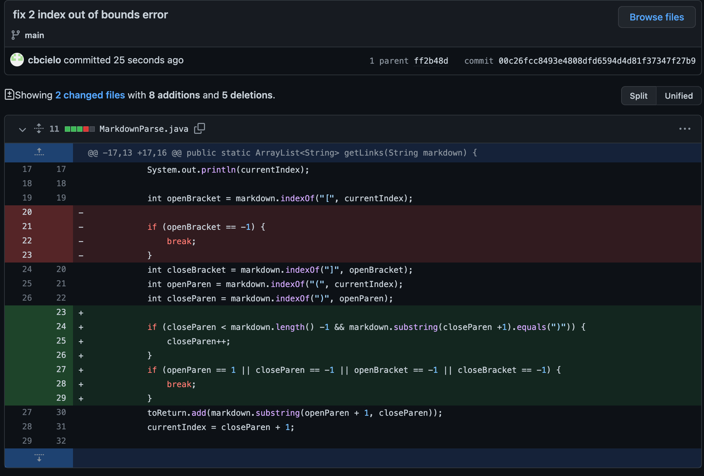
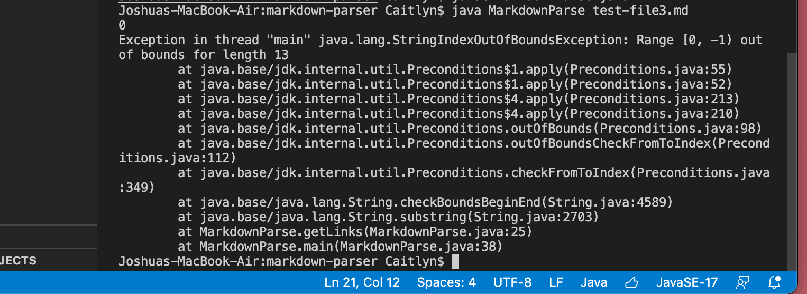
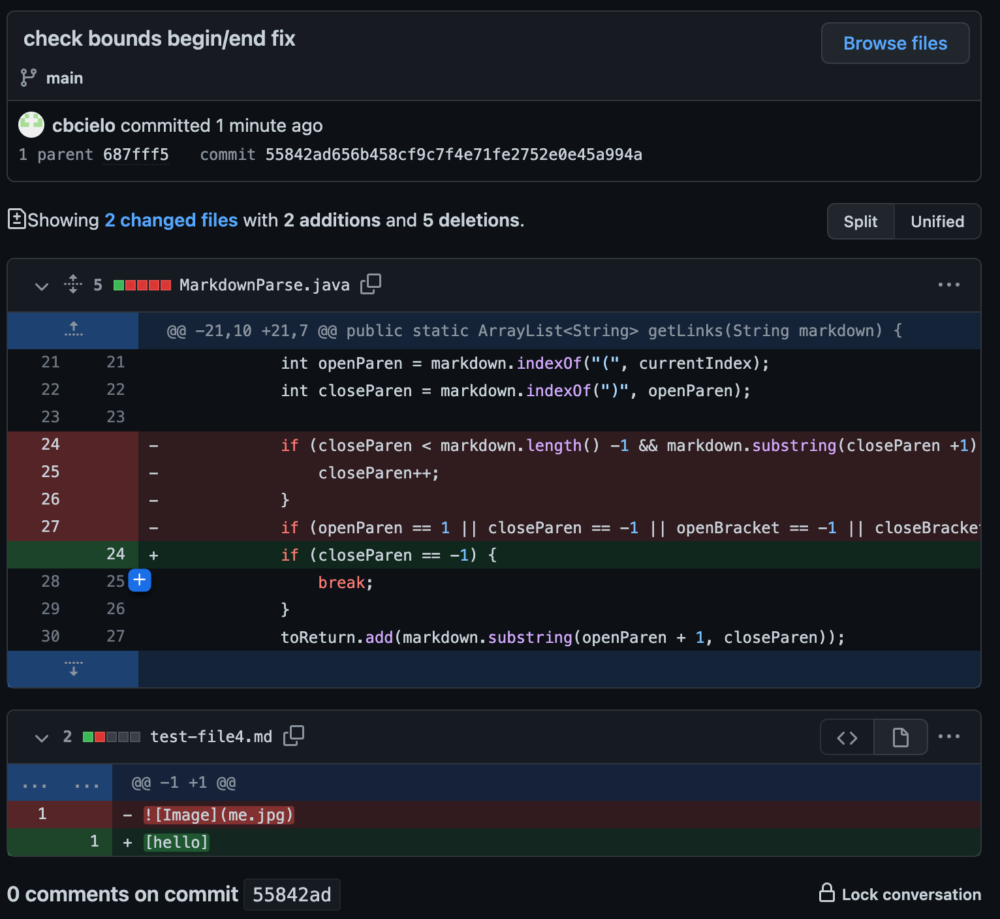
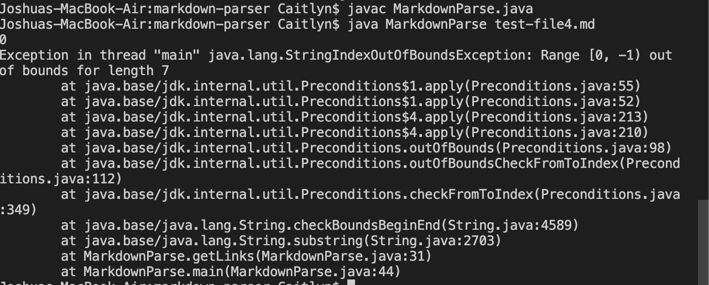

# Lab Report 2, Week 4

> This week I am assessing failure-inducing input and their symptoms and showing the process of debugging.

## BUG 1

## Code Changes 

Click [here](https://github.com/cbcielo/markdown-parser/blob/main/test-file2.md) for the link to the test file with *failure-inducing input*

**Symptom of the Input**: Infinite Loop in the terminal!

**The Relationship Between the Bug, Symptom, and Failure-Inducing Input:**

In this case, the bug is caused by the two empty lines of code that are after the last link (lines 4 and 5). The symptom of this test is that it produces an infinite loop due to the fact that the failure-inducing input causes the program to not check the `indexOf` output after it finds the very last link in the file.

## BUG 2

## Code Changes 

Click [here](https://github.com/cbcielo/markdown-parser/blob/main/test-file3.md) for the link to the test file with *failure-inducing input*

**Symptom of the Input**:
Index Out of Bounds Error!

**The Relationship Between the Bug, Symptom, and Failure-Inducing Input:**
The failure inducing input is that the test file does not contain any links, or open parenthesis, which the program checks for. The bug is caused by this because the program does not address edge cases that deal with the open parenthesis. The symptom of this is that it causes and index error (`StringIndexOutofBoundsException`).

## BUG 3

## Code Changes 

Click [here](https://github.com/cbcielo/markdown-parser/blob/main/test-file4.md) for the link to the test file with *failure-inducing input*

**Symptom of the Input**:
Index out of bounds error!

**The Relationship Between the Bug, Symptom, and Failure-Inducing Input:**

In this case, the bug is that the program fails to check for closed parenthesis after the brackets (ex: ``) as the failure inducing input is simply just enclosed by brackets. The symptom of this is the `IndexOutofBoundsException` that is thrown in the terminal. Because the test file is missing this, the `closeParen` index becomes -1 and causes the symptom to show.

