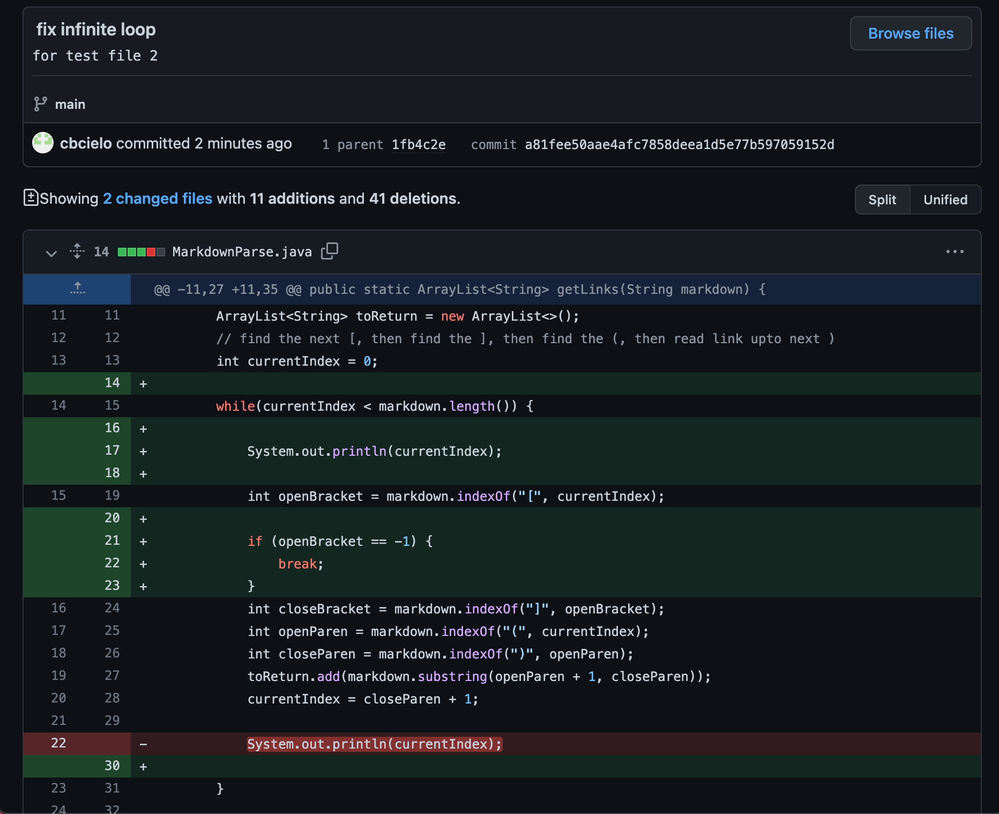
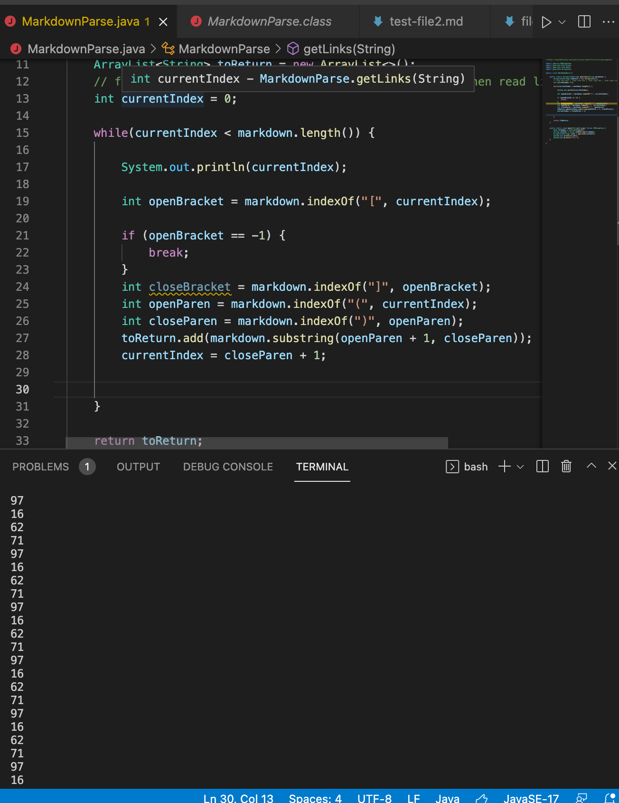

# Lab Report 2, Week 4

> This week I am assessing failure-inducing input and their symptoms and showing the process of debugging.

## BUG 1

Click [here](https://github.com/cbcielo/markdown-parser/blob/main/test-file2.md) for the link to the test file with *failure-inducing input*

**Symptom of the Input**: Infinite Loop in the terminal!

**The Relationship Between the Bug, Symptom, and Failure-Inducing Input:**

In this case, the bug is caused by the two empty lines of code that are after the last link (lines 4 and 5). The symptom of this test is that it produces an infinite loop due to the fact that the failure-inducing input causes the program to not check the `indexOf` output after it finds the very last link in the file.

## BUG 2

(INSERT SCREENSHOT 1 HERE)

(INSERT LINK TO FAILURE INDUCING INPUT)

**Symptom of the Input**:

**The Relationship Between the Bug, Symptom, and Failure-Inducing Input:**

## BUG 3

(INSERT SCREENSHOT 1 HERE)

(INSERT LINK TO FAILURE INDUCING INPUT)

**Symptom of the Input**:

**The Relationship Between the Bug, Symptom, and Failure-Inducing Input:**

