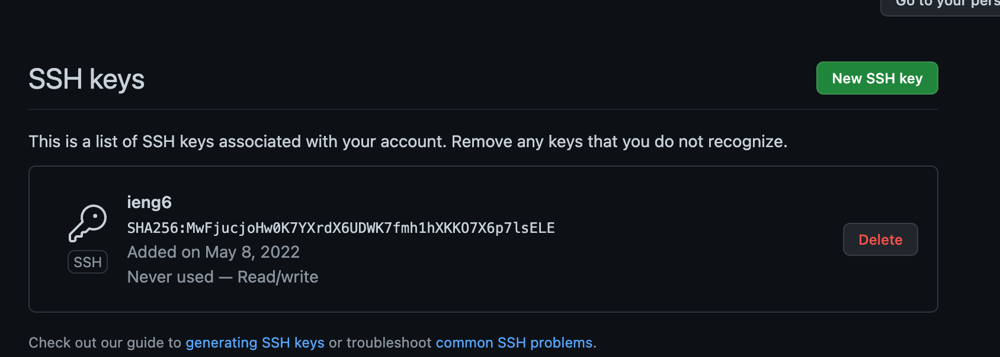
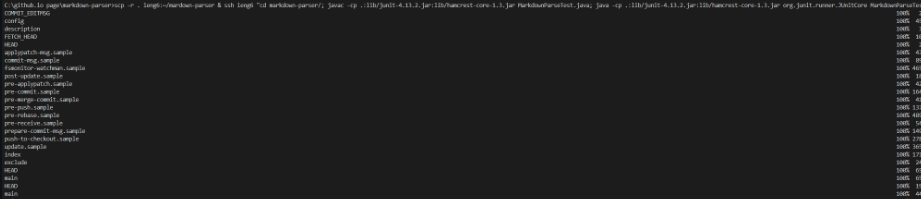

# Lab Report 3, Week 6
Hello! This weeks lab report focuses on improving work efficiency though:
* streamlining ssh configuration
* setting up Github access through ieng6
* copying full directories using the scp -r shortcut to a remote server

Let's get started!

## StreamLining `ssh Configuration`

* show `.ssh/config` file and how you edited it with vscode

Here I am showing my `config` file and the contents I edited with
I used:

`Host ieng`
	
`HostName ieng6.ucsd.edu`
	
`User cs15lsp22amh`

* show `ssh` command log in using just the alias you chose

I then logged in using `ssh ieng`

* show an `scp` command copying the file to your account using the alias you chose

I then copied the `WhereAmI.java` file as an example 

## Setting Up Github Access Through `ieng6`

* show where the public key you made is stored on Github and in your user account (screenshot)

Here is where the public key is stored in github 

* show where the private key you made is stored on your user acccount but not its contents (screenshot)

Here is where the private key is stored

* show running git commands to commit/push a change to Github while logged into `ieng6` account

Here I ran the `git commit` and `git add .` and `rm` to remove an empty test file I had made.

The link for resuting commit can be found [here](https://github.com/cbcielo/markdown-parser/commit/cf431e555463f371973c499e3d55f8c342b44320).

## Copy Directory Using `scp -r`

* show copying whole markdown parse directory to ieng account

Here I used `pwd`, `ls`, and `scp -r . ieng6:~/markdown-parse` to copy the file to the remote account

* show logging into ieng6 account after this and compiling/running tests for repository 

Here I compiled and ran `MarkdownParseTest.java`

* show (like in last step of first lab) combining `scp`, `;`, and `ssh` to copy the whole directory and run the tests in one line

(idk why the quality is low)

