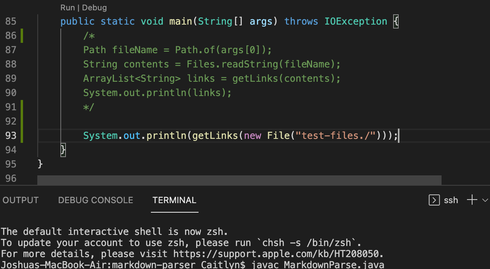
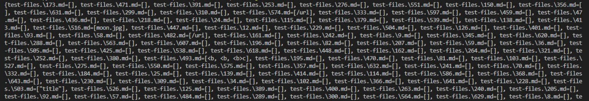
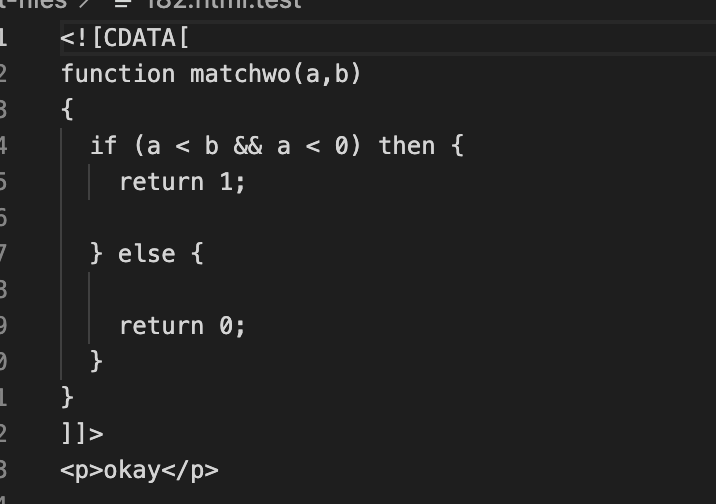
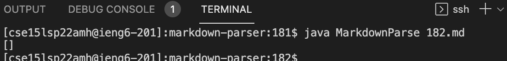
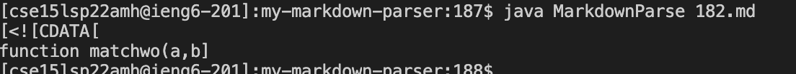
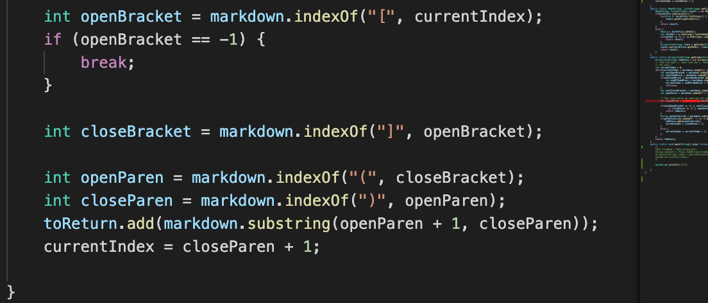
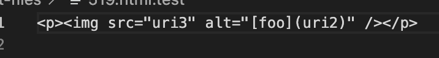
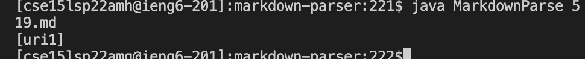
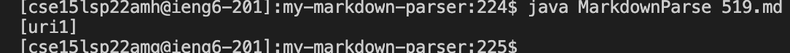
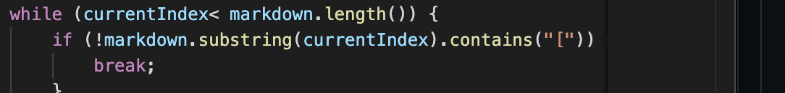

# Week 10 Lab Report 5 

## Finding Tests

I found tests with the different results by first adding a print statement to the MarkdownParse main method shown here: 

I then compiled and ran the MarkdownParse file in the terminal and recivied a printed list of the test files shown here: 

Click [here](https://github.com/nidhidhamnani/markdown-parser/tree/main/test-files) to see the different test-files in Github.

# Test 1: [182.md](https://github.com/nidhidhamnani/markdown-parser/blob/main/test-files/182.md) and [182.html.test](https://github.com/nidhidhamnani/markdown-parser/blob/main/test-files/182.html.test)

Here is the test as is:

The expected output for this test looks like this:
> `[]`

(okay)

However, after running the test in the terminal, the output looks like the following: 

## Lab Implementation: 

> Output: []

## My `my-markdown-parser` Implementation:

> Output: (shown in image)

- The correct implementation is the Lab 9 implementation because there are no links in the list in the 182.md file

One thing that I can look into fixing in my my-markdown-parser implementation is looking at what happends when `openParn` is non-existent (-1).

I can potentially fix this bug by adding an if statement that will only add the links in their indexes are NOT equal to -1 (when openParen is non-existent) As is, the code will excute and start from index -1 and add one to `closeParen` (-1+1).

# Test 2: [519.md](https://github.com/nidhidhamnani/markdown-parser/blob/main/test-files/519.md) and [519.html.test](https://github.com/nidhidhamnani/markdown-parser/blob/main/test-files/519.html.test)

Here is the test as is:

The expected output for this test looks like this:
> `[]`

`(uri2)](uri3)`

However, after running the test in the terminal, the output looks like the following:

## Lab Implementation

## My `my-markdown-parser` Implementation:

We can see here that both the lab implementation and my implementation produce an incorrect output. There should be empty brackets instead since there are no links in the test file.

Here is where I believe the bug occurs in the code:

In order to fix it, I would most likely put some sort of if statement above the condtion that states if a `!` is found at any of the indicies in the file, to break the while loop right off of the bat.

